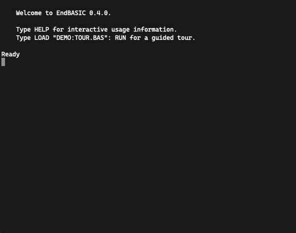

# The EndBASIC programming language

[](https://travis-ci.org/jmmv/endbasic/)

EndBASIC is an interpreter for a BASIC-like language and is inspired by
Amstrad's Locomotive BASIC 1.1 and Microsoft's QuickBASIC 4.5.  Like the former,
EndBASIC intends to provide an interactive environment that seamlessly merges
coding with immediate visual feedback.  Like the latter, EndBASIC offers
higher-level programming constructs and strong typing.  The main idea behind
EndBASIC is to provide a playground for learning the foundations of programming
in a simplified environment.

EndBASIC is written in Rust.  The parser and interpreter's primary goal is to
be readable and easy to modify.  A secondary goal is to make the core minimal,
extensible, and configurable.  Performance is not a goal right now, though it
likely won't disappoint.

EndBASIC is free software under the [Apache 2.0 License](LICENSE).

## Overview

The latest version of EndBASIC is 0.4.0 and was released on 2020-12-25.

*   For language features, see [`core/README.md`](core/README.md).
*   For usage details of the command-line interpreter, see
    [`cli/README.md`](cli/README.md).
*   For the web interface, see [`web/README.md`](web/README.md).
*   For changes across versions, see [`NEWS.md`](NEWS.md).

Here is a little demo:



## Quick start

Simply open EndBASIC right in your browser by visiting:

> <https://endbasic.jmmv.dev/>

The whole interpreter runs locally.  Any programs you write are persisted in
your browser's local storage and not uploaded to the cloud.

You can also read blog posts on EndBASIC, which cover the motivation behind the
project, guided tours, etc. by visiting:

> <https://jmmv.dev/tags/endbasic/>

## Installation

There currently are no binary releases for EndBASIC.  To install, first get a
Rust toolchain (either from your system's package manager, if any, or using
[`rustup`](https://www.rust-lang.org/learn/get-started)) and then build from
source using `cargo`:

```shell
cargo install endbasic
```

## Examples

EndBASIC comes bundled with a collection of demo programs that you can load and
run in the REPL and the web.  Type `DIR` to see the list of available demos,
then type `LOAD "DEMO:NAME.BAS"` to load a specific demo into memory, and then
run it with `RUN`.  For example:

```text
Ready
DIR

    Modified              Size    Name
    2020-12-22 14:20       651    DEMO:HELLO.BAS

    1 file(s), 651 bytes

Ready
LOAD "DEMO:HELLO.BAS"
Ready
RUN
What's your name? Julio
Hello, Julio!
```

You can also browse the sample files right from this tree by heading to the
[`core/examples`](core/examples) directory.  In there, you will find the `.bas`
demo files as well as `.rs` files showing how to embed the EndBASIC interpreter
in your own programs.

## Why EndBASIC?

EndBASIC started as part of my desire to teach programming to my own kids.
I remember learning programming on an old Amstrad CPC 6128: the experience was
unique in the sense that every command had immediate effect.  Changing colors,
drawing on the screen, or playing sounds were just a few keystrokes away after
booting the computer, without the need to deal with separate editors and
terminals.  I've noticed a similar excitement in my kids when showing this to
them via an emulator, so I thought I would replicate this in a more modern
fashion.  And here we are.

Because of this inspiration, EndBASIC's name stands for "E. and D.'s BASIC"
following my kids first name initials.
