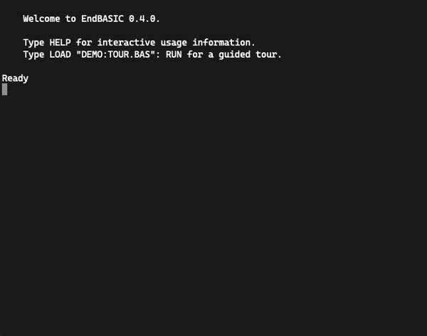
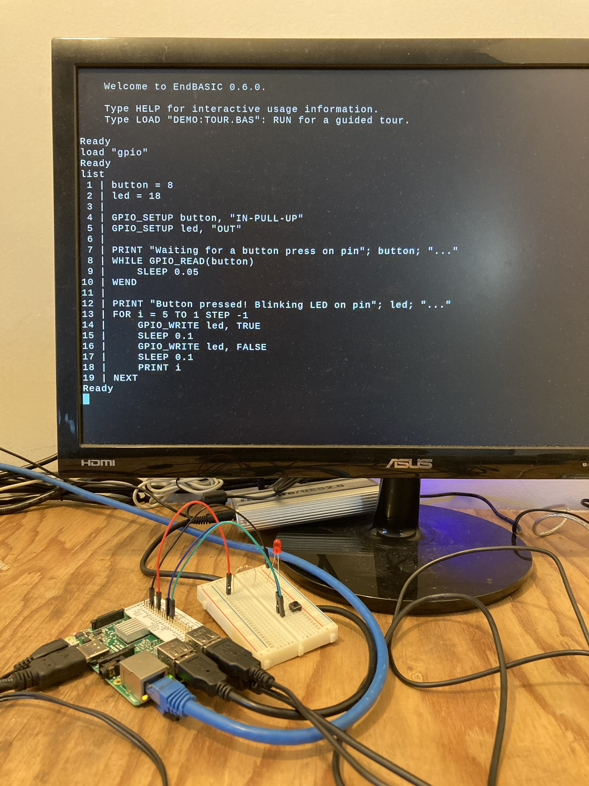

# The EndBASIC programming language

EndBASIC is an interpreter for a BASIC-like language and is inspired by
Amstrad's Locomotive BASIC 1.1 and Microsoft's QuickBASIC 4.5.  Like the former,
EndBASIC intends to provide an interactive environment that seamlessly merges
coding with immediate visual feedback.  Like the latter, EndBASIC offers
higher-level programming constructs and strong typing.

EndBASIC offers a simplified and restricted environment to learn the foundations
of programming and focuses on features that can quickly reward the programmer.
These features include things like a built-in text editor, commands to
manipulate the screen, and commands to interact with the hardware of a Raspberry
Pi.  Implementing this kind of features has priority over others such as
performance or a much richer language.

EndBASIC is written in Rust and runs both on the web and locally on a variety of
operating systems and platforms, including macOS, Windows, and Linux.

EndBASIC is free software under the [Apache 2.0 License](LICENSE).

**The latest version of EndBASIC is 0.5.1 and was released on 2021-01-25.**

## Quick start on the web

Open EndBASIC in your browser by visiting: <https://endbasic.jmmv.dev/>

This should work on all major desktop browsers and on iOS.  Unfortunately, there
are known issues on Android at the moment.

The web interpreter runs fully locally: any programs you write are persisted in
your browser's local storage and not uploaded to the cloud.

## Quick start on your machine

Visit the
[release page](https://github.com/jmmv/endbasic/releases/tag/endbasic-0.5.1) to
download prebuilt binaries.  Once downloaded, unpack the archive and run the
`endbasic` binary to get started.

Of course, you can also build and install EndBASIC from source by running the
following command (assuming you have a Rust toolchain installed): `cargo install
endbasic`.

## Gallery

Blog posts: <https://jmmv.dev/tags/endbasic/>

Sample code:

*   [`cli/examples`](cli/examples) contains the EndBASIC demo programs.  These
    are built into the interpreter and can be run with a command like
    `LOAD "DEMO:TOUR": RUN`.
*   [`core/examples`](core/examples) and [`std/examples`](std/examples)
    demonstrate how to embed the EndBASIC interpreter into your own programs.

A little demo of the interactive capabilities:

And a photo of an EndBASIC program controlling a Raspberry Pi:

## More information

The following documents provide more information:

*   For language features, see [`core/README.md`](core/README.md).
*   For standard library contents, see [`std/README.md`](std/README.md).
*   For usage details of the command-line interpreter, see
    [`cli/README.md`](cli/README.md).
*   For the web interface, see [`web/README.md`](web/README.md).
*   For changes across versions, see [`NEWS.md`](NEWS.md).

## Why EndBASIC?

EndBASIC started as part of my desire to teach programming to my own kids.
I remember learning programming on an old Amstrad CPC 6128: the experience was
unique in the sense that every command had immediate effect.  Changing colors,
drawing on the screen, or playing sounds were just a few keystrokes away after
booting the computer, without the need to deal with separate editors and
terminals.  I've noticed a similar excitement in my kids when showing this to
them via an emulator, so I thought I would replicate this in a more modern
fashion.  And here we are.

Because of this inspiration, EndBASIC's name stands for "E. and D.'s BASIC"
following my kids first name initials.
